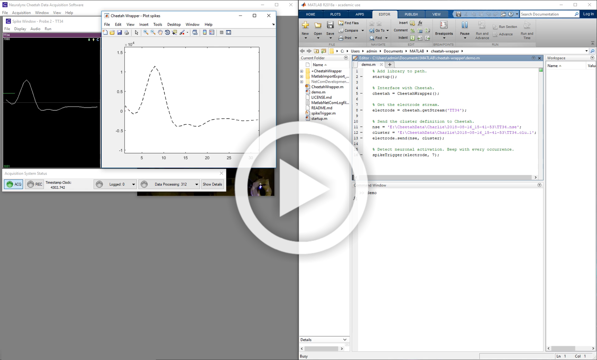

# Cheetah interface
MATLAB classes to interact with Cheetah Acquisition System from [Neuralynx][Neuralynx] during a recording session.
This library and Cheetah Acquisition Software may run in the same or in different computers.

A typical experiment consists of:
* Recording 5-10 minutes of spiking data
* Spike sorting and creating neuronal templates
* Acquiring more data to reinforce occurrences of selected neuronal state vectors in a feedback loop.


## Prerequisites
* [MATLAB][MATLAB] (last tested with R2018a)
* [Cheetah][Cheetah]
* [SpikeSort3D][SpikeSort3D] (optional)
* [NetComDevelopmentPackage][NetComPartial] (dependencies already included but can also be downloaded from [Neuralynx][NetComFull])
* Windows 10, 64Bit (32 bit version not tested).

## Installation
* Install MATLAB, Cheetah and SpikeSort 3D.
* Make sure MATLAB is enabled in Window's firewall. Normally a pop-up will come up during the first connection.
* Download and extract this library to Documents/MATLAB folder.

## Example 1 - plot spikes from a tetrode:
[](https://drive.google.com/file/d/19h34s5LPmWgZJFF17zxef8f8A4bYAu90)
* Record a few minutes of spiking data with Cheetah (tetrode TT1 must be one of the acquisition entities).
* Stop acquisition and sort data with KlustaKwik (e.g. via SpikeSort 3D)
* Start acquisition in Cheetah and run:
```matlab
	% Define acquisition entity name, waveform file, and cluster file.
	streamName = 'TT1';
	waveformFile = 'TT1.nse';
	clusterFile = 'TT1.clu.1';
	
	% Detect neuronal activation. Beep whenever a spike matches the target.
	ids = 1:10;
	count = 2;
	window = 0.200;
	
	% Interface with Cheetah.
	cheetah = CheetahWrapper();

	% Get the electrode stream.
	electrode = cheetah.getStream(streamName);

	% Send the cluster definition to Cheetah.
	electrode.send(waveformFile, clusterFile);
	patternTrigger(electrode, ids, count, window);

	% Produce a default stimulus when the given neuronal ensemble activates.
	patternTrigger(electrode, ids, count, window);
```

## Example 2 - list all acquisition entities loaded in the configuration file:
```matlab
	cheetah = CheetahWrapper();
	streams = obj.getStreams();
	for i = 1:numel(streams)
		stream = streams{i};
		disp(stream.name);
	end
```

## Example 3 - display acquisition time from one of the stream objects:
```matlab
	cheetah = CheetahWrapper();
	streams = obj.getStreams();
	while true
		data = streams{1}.getData();
		fprintf('Cheetah time= %.2f\n', data.timeStampArray(end));
	end
```
## Notes
The downside of running both programs in the same computer is that your analysis scripts may take up resources needed for data acquisition. The downside of running both programs in different computers is the delay introduced by the network communication.

## Version History
### 0.1.1
* Demo script now triggers based on ensemble activity.
* Test function takes an arbitrary stimulation function as input.
### 0.1.0
* Initial Release: Library and example code

## License
© 2019 [Leonardo Molina][Leonardo Molina]

This project is licensed under the [GNU GPLv3 License][LICENSE.md].

[Leonardo Molina]: https://github.com/leomol
[MATLAB]: https://www.mathworks.com/downloads/
[Cheetah]: https://neuralynx.com/
[SpikeSort3D]: https://neuralynx.com/software/spikesort-3d
[NetComPartial]: NetComDevelopmentPackage_v3.1.0
[NetComFull]: https://neuralynx.com/software/category/development
[Neuralynx]: https://neuralynx.com
[LICENSE.md]: LICENSE.md